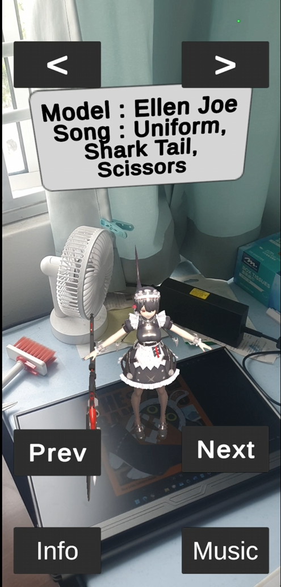

# Bu-Jia-Wei_AR_Project

## Description

This is an AR project built with Unity (version 6.x), utilizing Unity Visual Scripting to display and interact with art models. The project aims to showcase art and provide interactive features for future art-related experiences.

## Features

- Rotate models left and right
- Display pop-up information about each model and its associated song
- Switch between different models
- Play theme songs related to each model

## AR Marker

Use the following AR marker for the project:

## References

### Model Links

- **Jane:** [Link](https://www.bilibili.com/blackboard/era/yq0rxU7p1q95RH0b.html)
- **Burnice, Zhuyuan:** [Link](https://www.bilibili.com/blackboard/era/HMJlojL7gq6OQ3DQ.html)
- **Ellen, Astra, Evelyn:** [Link](https://www.bilibili.com/blackboard/era/lzdxvghInSo4oYjm.html)
- **Miyabi, Harumasa:** [Link](https://www.bilibili.com/blackboard/era/ZaU4lEQx4Czkwbsa.html)
- **Lighter, Yanagi:** [Link](https://www.bilibili.com/blackboard/era/eNm7VXZQObQCmav4.html)
- **Caesar:** [Link](https://www.bilibili.com/blackboard/era/luJehGdxqZndHGs1.html)
- **Qing Yi:** [Link](https://www.bilibili.com/blackboard/era/iI31wCpCkCkKle3I.html)

### Music Links

- **Evelyn Theme Song:** [YouTube](https://youtu.be/UGfUaFjNNL4?si=bc3l2qVOzwTUQSqz)
- **Astra Yao Theme Song:** [YouTube](https://youtu.be/h0_I6tWC520?si=NSg0P_9JDNvAJFgW)
- **Harumasa Theme Song:** [YouTube](https://youtu.be/tHvqR5mb5Vg?si=ThHkvTot2aU-edmW)
- **Miyabi Theme Song:** [YouTube](https://youtu.be/L6Mre_IeH3g?si=lNPsii-BWL7X_rat)
- **Lighter Theme Song:** [YouTube](https://youtu.be/MgnSKr-m_Fs?si=kMwL9fg2hBOcdbcI)
- **Yanagi Theme Song:** [YouTube](https://youtu.be/t6TKgz63HOA?si=2zBNA1jWZi59Hk3b)
- **Burnice Theme Song:** [YouTube](https://youtu.be/LPVDIDUQJdE?si=t9dG3huMvj-U1Cu_)
- **Caesar Theme Song:** [YouTube](https://youtu.be/24DCa4nN8BU?si=AyhEvnXv0lF8ilni)
- **Jane Theme Song:** [YouTube](https://youtu.be/JWWTUB4cXFw?si=w2c7deMe4qJ68cjf)
- **Qing Yi Theme Song:** [YouTube](https://youtu.be/dlkgxD5loXk?si=hk02mP06xE7h54lQ)
- **Zhu Yuan Theme Song:** [YouTube](https://youtu.be/yk3wBP6ZUb4?si=BRVOz1Nnn7e4KnKG)
- **Ellen Theme Song:** [YouTube](https://youtu.be/tiNgIAepbVM?si=5TZYL0QuFUcCsatY)
